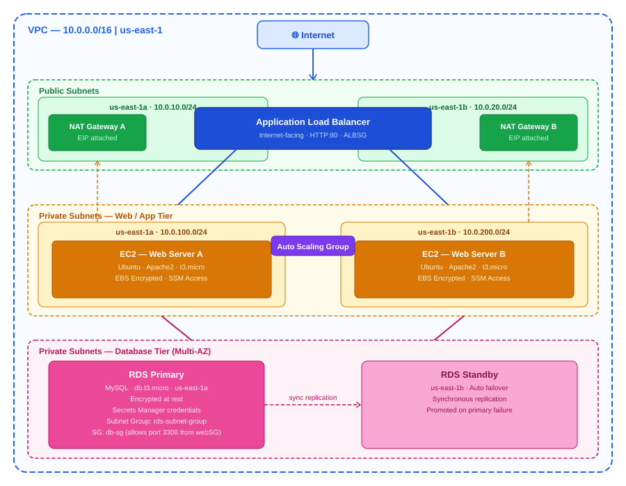
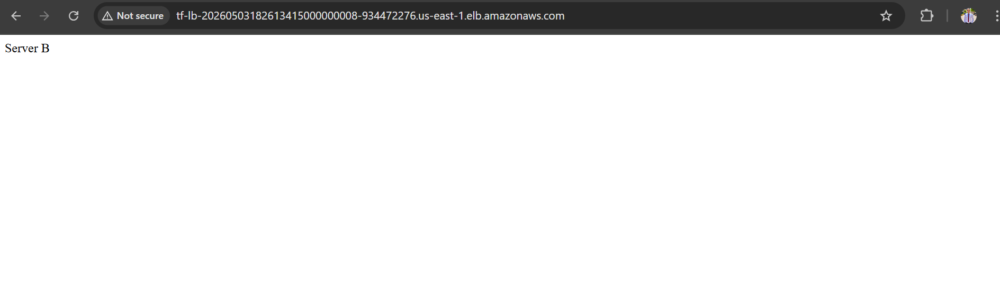

# 🚀 AWS Multi-Tier Web Application using Terraform

## 📌 Overview

This project demonstrates how to build a **highly available, scalable, and secure multi-tier web application** on AWS using **Terraform (Infrastructure as Code)**.

The architecture follows best practices by separating the application into multiple layers:

* 🌐 Presentation Layer (ALB)
* ⚙️ Application Layer (EC2 in Private Subnets)
* 🛢️ Data Layer (RDS - Multi AZ)

---

## 🏗️ Architecture



---

## 🧱 Infrastructure Components

### 🌐 Networking

* Custom VPC (`10.0.0.0/16`)
* 2 Public Subnets (ALB)
* 2 Private Subnets (EC2 + RDS)
* Internet Gateway
* NAT Gateways (one per AZ)
* Route Tables (public & private)

---

### ⚙️ Compute

* 2 EC2 instances (Apache Web Server)
* Auto Scaling Group for elasticity
* Encrypted EBS volumes

---

### ⚖️ Load Balancing

* Application Load Balancer (ALB)
* Target Group with health checks
* HTTP listener (Port 80)


---

### 🛢️ Database

* Amazon RDS (MySQL)
* Multi-AZ enabled
* Private subnet deployment
* Secure access via Security Groups

---

### 🔐 Security

* Security Groups:

  * ALB SG (HTTP from Internet)
  * Web SG (HTTP from ALB only)
  * DB SG (MySQL from Web only)
* Secrets Manager for DB credentials
* Encrypted storage (EBS + RDS)

---

## 📁 Project Structure

```
terraform-project/
│
├── main.tf
├── variables.tf
├── outputs.tf
│
├── modules/
│   ├── vpc/
│   ├── subnets/
│   ├── nat/
│   ├── security/
│   ├── ec2/
│   ├── alb/
│   ├── autoscaling/
│   ├── rds/
```

---

## ⚙️ Prerequisites

* AWS Account
* Terraform installed
* AWS CLI configured

```bash
aws configure
```

---

## 🚀 Deployment Steps

### 1️⃣ Initialize Terraform

```bash
terraform init
```

### 2️⃣ Validate Configuration

```bash
terraform validate
```

### 3️⃣ Preview Infrastructure

```bash
terraform plan
```

### 4️⃣ Apply Configuration

```bash
terraform apply
```


---

## 🌍 Access the Application

After deployment, Terraform will output:

```bash
alb_dns = <your-alb-dns>
```

👉 Open it in your browser:

```
http://<alb_dns>
```

You should see:

```
This is server 1...
```

Refresh multiple times to verify **Load Balancing** 
- Server A  

- Server B  

---

## 🧪 Testing

### ✅ Check Load Balancer

* Refresh browser → traffic should rotate between instances

### ✅ Check Target Health

* AWS Console → Target Groups → Targets → Healthy

### ✅ Check EC2

```bash
curl localhost
```

---

## 🧹 Destroy Infrastructure

To avoid charges:

```bash
terraform destroy
```

---

## 🔥 Key Features

* ✔️ High Availability (Multi-AZ)
* ✔️ Auto Scaling
* ✔️ Secure Architecture (Private Subnets)
* ✔️ Secrets Management
* ✔️ Infrastructure as Code (Terraform)
* ✔️ Production-ready Design

---

## 🚀 Future Improvements

* 🔐 HTTPS (ACM + ALB)
* 🌍 Custom Domain (Route53)
* 📊 Monitoring (CloudWatch)
* 🔄 CI/CD (GitHub Actions)
* 🛡️ WAF Integration


## ⭐ Notes

* Ensure NAT Gateway is configured correctly for private instances
* Do not expose database publicly
* Always use Secrets Manager for credentials

---

## 🎯 Conclusion

This project provides a **real-world production-grade AWS architecture** that demonstrates:

* Scalability
* Security
* High Availability
* Automation

